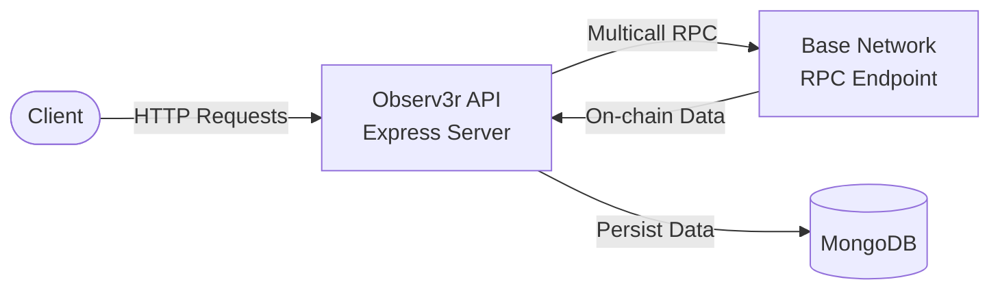

# Observ3r

Observ3r is a Deno-based on-chain observer API for the Base network. It provides REST endpoints to fetch and track DeFi positions across Aerodrome, Moonwell, and Chainlink protocols.

## Functional Description

### What it does

Observ3r exposes a REST API that allows you to:

- **Aerodrome Pool Tracking** (`GET /api/aerodrome/pool/:poolAddress`): Fetch pool/gauge data including reserves, TVL, user share, staked balance and earned rewards. Supports VFAT Sickle contracts for automated position tracking.

- **Moonwell Position Tracking** (`GET /api/moonwell`): Retrieve user positions across Moonwell core markets and Morpho vaults, including supply/borrow balances, collateral, and rewards.

- **Chainlink Price Feeds**: Integrated price oracle for token valuations (ETH, USDC, AERO, cbBTC, etc.).

### Data Persistence

All Aerodrome pool queries are persisted to MongoDB for historical tracking and analysis.

### Supported Protocols

| Protocol | Features |
|----------|----------|
| Aerodrome | Pool reserves, gauge staking, LP position value, reward tracking |
| Moonwell | Core market positions, Morpho vaults, supply/borrow/collateral |
| Chainlink | Real-time price feeds for Base network tokens |

---

## Architecture

### High-Level Overview



### Services & Smart Contract Interactions


---

## Prerequisites

- [Deno](https://deno.land/) v2.0+ installed
- MongoDB instance (local or cloud)
- Base network RPC URL (optional, defaults to public endpoint)

---

## Run Locally

### 1. Install dependencies

```bash
deno install
```

### 2. Set environment variables

```bash
export MONGODB_CONNECTION_STRING="mongodb://localhost:27017"
export RPC_URL="https://mainnet.base.org"        # Optional
export ETH_ADDRESS="0xYourAddress"               # Optional
```

### 3. Start the server

```bash
deno task start
```

Or run directly:

```bash
deno run --allow-net --allow-env main.ts
```

The server starts at `http://localhost:8000`.

### Available Tasks

| Task | Command | Description |
|------|---------|-------------|
| start | `deno task start` | Run the server |
| test | `deno task test` | Run tests |
| lint | `deno task lint` | Run linter |

---

## API Endpoints

### Aerodrome Pool Data

```http
GET /api/aerodrome/pool/:poolAddress?walletaddress=0x...
```

**Example:**
```bash
curl "http://localhost:8000/api/aerodrome/pool/0x4f09bab2f0e15e2a078a227fe1537665f55b8360?walletaddress=0xfbcbe7ad86b277a05fe260f037758cd5985e9c37"
```

**Response:**
```json
{
  "timestamp": "2024-01-15T10:30:00.000Z",
  "blockNumber": 12345678,
  "poolName": "vAMM-USDC/AERO",
  "poolAddress": "0x4f09...",
  "walletAddress": "0xfbcb...",
  "token0": "0x...",
  "token1": "0x...",
  "price0": 1.0,
  "price1": 0.85,
  "poolTVL": 1500000,
  "positionShare": 0.00015,
  "positionPrice": 225,
  "rewardEarned": 12.5
}
```

### Moonwell Positions

```http
GET /api/moonwell?walletaddress=0x...
```

**Example:**
```bash
curl "http://localhost:8000/api/moonwell?walletaddress=0xYourAddress"
```

---

## Build

### Build Docker Image

```bash
docker build -t observ3r:latest .
```

### Run with Docker

```bash
docker run -p 8000:8000 \
  -e MONGODB_CONNECTION_STRING="mongodb://host.docker.internal:27017" \
  -e RPC_URL="https://mainnet.base.org" \
  observ3r:latest
```

---

## Deploy

### CI/CD Pipeline

The project includes a GitHub Actions workflow (`.github/workflows/deno.yml`) that:

1. **On push to `develop` or `master`**: Runs linting
2. **On push to `master` only**: Builds and deploys to Azure Container Registry

### Required GitHub Secrets

| Secret | Description |
|--------|-------------|
| `AZURE_CREDENTIALS` | Azure service principal credentials (JSON) |
| `REGISTRY_LOGIN_SERVER` | Azure Container Registry URL |
| `REGISTRY_USERNAME` | ACR username |
| `REGISTRY_PASSWORD` | ACR password |

### Manual Deployment

1. Build the image:
   ```bash
   docker build -t <registry>/observ3r:latest .
   ```

2. Push to registry:
   ```bash
   docker push <registry>/observ3r:latest
   ```

3. Deploy to your container service (Azure Container Apps, AWS ECS, etc.) with the following environment variables:
   - `MONGODB_CONNECTION_STRING` (required)
   - `RPC_URL` (optional)

---

## Project Structure

```
Observ3r/
├── main.ts                    # Express server entrypoint
├── Services/
│   ├── Aerodrome/
│   │   ├── AerodromeService.ts    # Pool/gauge data fetching
│   │   ├── AerodromeSchema.ts     # MongoDB schema
│   │   └── AerodromePoolGauge.ts  # Pool address mappings
│   ├── Base/
│   │   ├── BaseService.ts         # RPC helpers, token balances
│   │   └── BaseTokens.ts          # Token metadata
│   ├── Chainlink/
│   │   ├── ChainlinkService.ts    # Price feed queries
│   │   └── DataFeeds.ts           # Feed address mappings
│   └── Moonwell/
│       └── MoonwellService.ts     # Moonwell SDK wrapper
├── data/
│   ├── data.json
│   └── documentDB.json
├── Dockerfile
├── deno.json                  # Dependencies and tasks
└── deno.lock
```

---

## Environment Variables

| Variable | Required | Default | Description |
|----------|----------|---------|-------------|
| `MONGODB_CONNECTION_STRING` | Yes | - | MongoDB connection URI |
| `RPC_URL` | No | `https://mainnet.base.org` | Base network RPC endpoint |
| `ETH_ADDRESS` | No | - | Default wallet address |

---

## Deno Permissions

The application requires:

- `--allow-net`: Network access for RPC calls and MongoDB
- `--allow-env`: Read environment variables

---

## License

See the [LICENSE](LICENSE) file for license terms.
